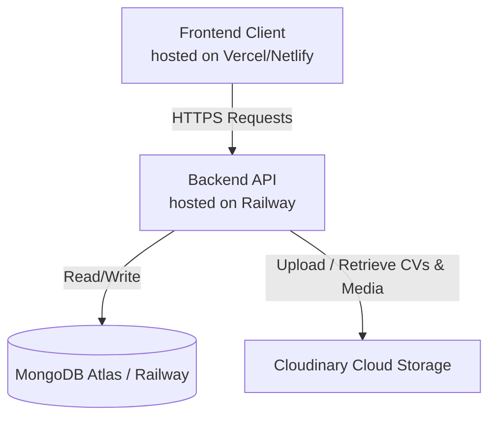

# TitanCore Deployment Guide

This guide explains how to deploy the TitanCore project:
1. **Backend API** hosted on **Railway** (Node.js/Express)
2. **Frontend client** hosted on **Vercel** or **Netlify** (Vite/React - free static hosting)

---

## Architecture Overview



By deploying the frontend as a static site and the backend on Railway, you take advantage of **free high-performance static hosting** for the user interface, and only run the active server for API requests and logic.

---

## Phase 1: Deploy Backend on Railway

### 1. Set Up your Project
1. Log in to [Railway.app](https://railway.app).
2. Click **New Project** in the dashboard.
3. Select **Deploy from GitHub repo** and authenticate with GitHub if you haven't already.
4. Select the `TitanCore` repository.

### 2. Configure Service Settings
By default, Railway will try to deploy from the root directory. Since this is a monorepo, we need to configure it to deploy the backend:
1. In the Railway project board, click on the newly created service.
2. Go to the **Settings** tab.
3. Scroll down to **General** -> **Root Directory** and set it to:
   ```text
   backend
   ```
4. Railway will automatically detect the `package.json` in the `backend` folder, run `npm install`, and start the app using `npm start` (which runs `node server.js`).

### 3. Add Environment Variables
Go to the **Variables** tab of the backend service and click **New Variable** (or **Raw Editor** to paste them all at once). Add the following variables:

| Variable | Recommended Value / Source |
| :--- | :--- |
| `NODE_ENV` | `production` |
| `MONGO_URI` | Your MongoDB Atlas connection string (or use Railway's built-in MongoDB service) |
| `JWT_SECRET` | A secure, random string (e.g. `your-super-secret-key`) |
| `CLOUDINARY_CLOUD_NAME` | Your Cloudinary Cloud Name |
| `CLOUDINARY_API_KEY` | Your Cloudinary API Key |
| `CLOUDINARY_API_SECRET` | Your Cloudinary API Secret |

> [!NOTE]
> `PORT` is automatically injected and managed by Railway. The backend code is already configured to bind to `process.env.PORT`.

### 4. Expose the Backend URL
1. In the service's **Settings** tab, scroll to the **Public Networking** section.
2. Click **Generate Domain** (or set up a custom domain).
3. Copy this generated URL (e.g., `https://titancore-production.up.railway.app`). **You will need this for the frontend setup.**

---

## Phase 2: Deploy Frontend on Vercel or Netlify

We recommend deploying the frontend to **Vercel** or **Netlify** as it is completely free, serves your site via a global CDN, and triggers automatic redeployments on every git push.

### Option A: Hosting on Vercel (Recommended)
1. Go to [Vercel.com](https://vercel.com) and log in.
2. Click **Add New** -> **Project**.
3. Select the `TitanCore` repository.
4. In the Project Configuration:
   * **Framework Preset**: Select **Vite** (if not auto-detected).
   * **Root Directory**: Click *Edit* and select:
     ```text
     frontend
     ```
   * **Build & Development Settings**: Leave as default (`npm run build` / `dist`).
5. Open the **Environment Variables** section and add:
   * **Name**: `VITE_API_URL`
   * **Value**: Your Railway backend domain URL with `/api` appended (e.g., `https://titancore-production.up.railway.app/api`).
6. Click **Deploy**. Vercel will build and serve your frontend.

### Option B: Hosting on Netlify
1. Go to [Netlify.com](https://netlify.com) and log in.
2. Click **Add new site** -> **Import an existing project**.
3. Choose **GitHub** and select your `TitanCore` repository.
4. Configure the build settings:
   * **Base directory**: `frontend`
   * **Build command**: `npm run build`
   * **Publish directory**: `frontend/dist`
5. Click **Add environment variables** and enter:
   * **Key**: `VITE_API_URL`
   * **Value**: Your Railway backend domain URL with `/api` appended (e.g., `https://titancore-production.up.railway.app/api`).
6. Click **Deploy**.

---

## Important Verification & Troubleshooting

### Cloudinary File Uploads
We updated the backend CV/Resume uploads to save directly to **Cloudinary** (instead of the local filesystem). This prevents files from disappearing when Railway containers restart or redeploy. 
* Ensure your Cloudinary credentials are correct.
* PDFs are uploaded as `image` resource type (enabling inline viewing in browsers).
* Word documents (`.doc`, `.docx`) are uploaded as `raw` resource type.

### CORS Configuration
The backend has `cors()` middleware enabled without origin restrictions by default, meaning it will accept requests from your newly deployed frontend domain. If you restrict CORS in the future, remember to add your Vercel/Netlify frontend domain to the allowed origins list.
